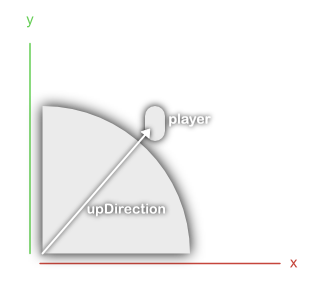

This tutorial assumes you've finished week 2's lecture. You can view the final code (aka source code) for this project in the "Intro-to-Voxel-Terrain-in-Unity" repo linked in the README file.

To make a planet first we have to figure out how to calculate where a voxel should be, and where it shouldn't be.

Make a new micro project in the course project. Don't make a separate Unity project because we will be reusing code from previous lectures).

```
Assets/
    |___...other micro projects from course...
    |___SimplePlanet
        |___SimplePlanet.cs
        |___SimplePlanetChunk.cs
        |___SimplePlanet.unity (scene)
```

Now paste all the code from the `JobWorldChunk` class into the `SimplePlanetChunk` class. You will need to add some `using` statements at the top to include support for the `NativeArray`'s and the Jobs.

```cs
using UnityEngine;
using Unity.Collections;
using Unity.Jobs;

public class SimplePlanetChunk : MonoBehaviour
{
    // ... snipping pasted code
}
```

Also you will need to change the constructor function to be the same as the class name (since it was pasted from another class it is different).

```cs
public class SimplePlanetChunk : MonoBehaviour
{
    // ... snip

    public SimplePlanetChunk(Material m_material, Vector3 m_position)
    {
        // ... snip
    }

    // ... snip
}
```

Now past all the code from the JobWorld class (week 2) into the SimplePlanet class.

The current noise algorithm the `SimplePlanetChunk` is using right now is not going to work for making a planet. We could just edit the current job from the `JobWorld` project but that would break our previous projects.

Lets make a new Job in the `JobDefs` class (we made the `JobDefs` class earlier in the course to hold all of the Job's we would make, since there will be many in the course).

Copy our old `ChunkJob` paste it and rename it to `PlanetChunkJob`.

(For now we are not using the `FastNoiseLite` instance in the Job, but leave it there because we will use it later)

Now we have to change the `IsSolid` function to do planet generation. We will calculate the distance from the center of the planet to the current voxel position. If the distance is greater than the planet radius we want we will return false, meaning a voxel should not be made there.

Change `PlanetChunkJob` to take in a planetRadius, and use the planetRadius variable to calculate the distance between a voxel's position and the center of the planet.

```cs
    public struct PlanetChunkJob : IJob
    {
        public float planetRadius;

        // ... snipping unchanged code

        private bool IsSolid(FastNoiseLite noise, int x, int y, int z)
        {
            float distance = Vector3.Distance(new Vector3(x, y, z) + chunkPos, Vector3.zero);

            if (distance <= planetRadius)
            {
                return true;
            }
            else
            {
                return false;
            }
        }
    }
```

Right now we assume the planet is at the center of the world so we just use `Vector3.zero` (make sure the planet gameObject you make later is actually at the center of the world). If you don't want the planet to be in the center of the world then feel free to add a `Vector3 planetPos` to the job struct (make sure to set this variable later tho!).

Change `SimplePlanetChunk`'s `ScheduleDraw` function use the new job we created. Also add a member variable to hold a reference of the `SimplePlanet` parent class, so that we can access a planetRadius variable that we will add to the `SimplePlanet` class.

In the following code I highlight the changes 

```cs
public class SimplePlanetChunk
{
    // ... snipping unchanged code

    private SimplePlanet m_owner; // added

    // ... snipping unchanged code

    private JobDefs.PlanetChunkJob m_chunkJob; // changed

    public SimplePlanetChunk(SimplePlanet owner, Material m_material, Vector3 m_position) // changed
    {
        m_owner = owner; // added

        // ... snipping unchaged code
    }

    public void ScheduleDraw()
    {
        if (needsDrawn == true)
        {
            // ... snipping unchanged code

            m_chunkJob = new JobDefs.PlanetChunkJob(); // changed
            m_chunkJob.planetRadius = m_owner.planetRadius; // added
            // ... snipping unchanged code
        }
    }

    // ... snipping unchanged code
}
```

Now lets add the planetRadius variable, and actually generate this planet! Open up SimplePlanet.cs and add the following boiler plate code.

```cs
using UnityEngine;

public class SimplePlanet : MonoBehaviour
{
    public Material material;
    public JobWorldChunk1[,,] chunks = new JobWorldChunk1[DataDefs.chunkNum, DataDefs.chunkNum, DataDefs.chunkNum];
    public Transform player;
    public float planetRadius = 100;
}
```

We take in a reference to a material for the chunk class to assign to its gameObject's `MeshRenderer`. 

Then we have a 3D array of `SimplePlanetChunk`'s which will hold each chunk. It is a 3D array becuase we will now be generating chunks in all three directions, whereas in the `JobWorld` from week 2 we only generate in directions (namely `x` and `z`).

Then we take in a reference to the player so that we can generate the world around the player. And finally we have a paramter for setting the planet radius.

Now paste in some familiar chunk recycling code.

```cs
public class SimplePlanet : MonoBehaviour
{
    // ... snipping unchanged code
    
    private void RecycleChunks()
    {
        for (int x = 0; x < DataDefs.chunkNum; x++)
        {
            for (int y = 0; y < DataDefs.chunkNum; y++)
            {
                for (int z = 0; z < DataDefs.chunkNum; z++)
                {
                    // x
                    if (player.position.x + offset < chunks[x, y, z].gameObject.transform.position.x)
                    {
                        chunks[x, y, z].gameObject.transform.position -= new Vector3(DataDefs.chunkNum * DataDefs.chunkSize, 0, 0);
                        chunks[x, y, z].needsDrawn = true;
                    }
                    if (player.position.x - offset > chunks[x, y, z].gameObject.transform.position.x)
                    {
                        chunks[x, y, z].gameObject.transform.position += new Vector3(DataDefs.chunkNum * DataDefs.chunkSize, 0, 0);
                        chunks[x, y, z].needsDrawn = true;
                    }

                    // y
                    if (player.position.y + offset < chunks[x, y, z].gameObject.transform.position.y)
                    {
                        chunks[x, y, z].gameObject.transform.position -= new Vector3(0, DataDefs.chunkNum * DataDefs.chunkSize, 0);
                        chunks[x, y, z].needsDrawn = true;
                    }
                    if (player.position.y - offset > chunks[x, y, z].gameObject.transform.position.y)
                    {
                        chunks[x, y, z].gameObject.transform.position += new Vector3(0, DataDefs.chunkNum * DataDefs.chunkSize, 0);
                        chunks[x, y, z].needsDrawn = true;
                    }

                    // z
                    if (player.position.z + offset < chunks[x, y, z].gameObject.transform.position.z)
                    {
                        chunks[x, y, z].gameObject.transform.position -= new Vector3(0, 0, DataDefs.chunkNum * DataDefs.chunkSize);
                        chunks[x, y, z].needsDrawn = true;
                    }
                    if (player.position.z - offset > chunks[x, y, z].gameObject.transform.position.z)
                    {
                        chunks[x, y, z].gameObject.transform.position += new Vector3(0, 0, DataDefs.chunkNum * DataDefs.chunkSize);
                        chunks[x, y, z].needsDrawn = true;
                    }
                }
            }
        }
    }
}
```

This is exactly the same code as the `RecycleChunks` function from week 2's `JobWorld` the only difference is that we are now recycling in the `y` axis.

As a refresher the code goes through each chunk and checks it's position, if say the `x` position of the chunk is farther away than the offset the chunk gets moved to the other side of the world, and its `needsDrawn` variable is set to true.

Make a function that schedules all the draw jobs for each chunk.

```cs
    private void ScheduleChunks()
    {
        for (int x = 0; x < DataDefs.chunkNum; x++)
        {
            for (int y = 0; y < DataDefs.chunkNum; y++)
            {
                for (int z = 0; z < DataDefs.chunkNum; z++)
                {
                    chunks[x, y, z].ScheduleDraw();
                }
            }
        }
    }
```

Now make another function that Completes all the draw jobs each chunk. When complete is called it waits for the job to finish and then sets the chunks mesh.

```cs
    private void CompleteChunks()
    {
        for (int x = 0; x < DataDefs.chunkNum; x++)
        {
            for (int y = 0; y < DataDefs.chunkNum; y++)
            {
                for (int z = 0; z < DataDefs.chunkNum; z++)
                {
                    chunks[x, y, z].CompleteDraw();
                }
            }
        }
    }
```

Now finally in start we can generate each chunk in a grid. Then make sure they are in the correct position relative to the player, before we spend a long time drawing them, by calling the `RecycleChunks` function.

```cs
    private void Start()
    {
        for (int x = 0; x < DataDefs.chunkNum; x++)
        {
            for (int y = 0; y < DataDefs.chunkNum; y++)
            {
                for (int z = 0; z < DataDefs.chunkNum; z++)
                {
                    Vector3 position = new Vector3(x * DataDefs.chunkSize, y * DataDefs.chunkSize, z * DataDefs.chunkSize);
                    chunks[x, y, z] = new SimplePlanetChunk(this, material, position);
                }
            }
        }

        RecycleChunks(); // "recycle" chunks into the correct position to prevent from drawing them and then having to move them again (although if the player is super far away then this problem will still happen)
    }
```

In `Update` call the `ScheduleChunks` and `CompleteChunks` functions to generate all the chunks meshes. We also recycle all the chunks right before we draw them.

```cs
    private void Update()
    {
        RecycleChunks();

        ScheduleChunks();
        CompleteChunks();
    }
```

Open the SimplePlanets.unity scene and add a gameObject called "Planet" (Make sure it is in the center of the world!) then attach the `SimplePlanet` component script and assign the material. Also create a gameObject to act as the player, so the terrain can generate around it.

Before you hit play make sure to change the chunkNum variable in Data.cs to a lower number like 15 or you will be waiting a long time for all those Jobs to finish running. Now if you hit play you should see a planet! Move the player gameObject around to see the terrain regenerate.

# Planet Mountains?
Lets make some mountains! Open the `PlanetChunkJob` job. We will use the noise instacne that we didn't delete (hopefully you didn't either). Now when we calculate the distance variabel we can just add noise based on the voxel positon.

```cs
        private bool IsSolid(FastNoiseLite noise, int x, int y, int z)
        {
            float distance = Vector3.Distance(new Vector3(x, y, z) + chunkPos, Vector3.zero);

            // add to the distance variable
            distance += noise.GetNoise(x + chunkPos.x, y + chunkPos.y, z + chunkPos.z) * 10;

            if (distance <= planetRadius)
            {
                return true;
            }
            else
            {
                return false;
            }
        }
```

We multiply the noise by 10. Multiplying the noise by 10, incereases the "size" of affect the noise has. The "size of affect" is called the "amplitude". Now hit play and the pnaet should have mountains! Ok, they are more like hills...

We also make sure to add the chunkPos offset to the noise calculation, or all the chunks will have the same noise applied, which will make the planet look broken.

Now lets make it so that we can change the amplitude on the inspector.

Add a variable to the chunkJob for noise amplitude. And use it as the noise multiplier.

```cs
    public struct PlanetChunkJob : IJob
    {
        public float amplitude;

        private bool IsSolid(FastNoiseLite noise, int x, int y, int z)
        {
            // ... snip

            distance += noise.GetNoise(x + chunkPos.x, y + chunkPos.y, z + chunkPos.z) * amplitude;

            // ... snip
        }
    }
```

We can also multiply the positions we sample by a number to expans the area of noie we sample, which will give us more small details and bumps (be carefull, because this can give you a planet full of random tiny holes!).

```cs
    public struct PlanetChunkJob : IJob
    {
        public float frequency;
        // ... snip

        private bool IsSolid(FastNoiseLite noise, int x, int y, int z)
        {
            // ... snip

            distance += noise.GetNoise((x + chunkPos.x) * frequency, (y + chunkPos.y) * frequency, (z + chunkPos.z) * frequency) * amplitude;
            
            // ... snip
        }
    }
```

But... the FastNoiseLite library has a function for doing this for us. So remove the frequency multiplication we just did and use the library function instead (make sure to remove what we did before if you use the library function!).

```cs

    public struct PlanetChunkJob : IJob
    {
        // ... snip

        public void Execute()
        {
            FastNoiseLite noise = new FastNoiseLite();
            noise.SetNoiseType(FastNoiseLite.NoiseType.OpenSimplex2);
            noise.SetFrequency(frequency); // added this

            // ... snip
        }

        // ... snip
    }
```

0.02 is the default frequency in FastNoiseLite.

Now we have to set the frequency variable and the amplitude variable when we schedule our job. First though, we probably want to set these values in the inspector so open `SimplePlanet` and add two values for our inspector. We clamp the freqquency to a small value because a small change in frequency has a very big impact.

```cs
public class SimplePlanet : MonoBehaviour
{
    // ... snip

    [Range(0, 0.5f)]
    public float frequency = 0.02f;

    public float amplitude = 10;

    // ... snip
}
```

And since we have access to the `SimplePlanet` class in the `SimplePlanetChunk` through the `m_owner` variable we can just access the variables directly from the `SimplePlanet` class and use them when setting the job.

```cs

public class SimplePlanetChunk
{
    // ... snip

    public void ScheduleDraw()
    {
        if (needsDrawn == true)
        {
            // ... snip

            m_chunkJob = new JobDefs.PlanetChunkJob();
            m_chunkJob.amplitude = m_owner.amplitude; // added this
            m_chunkJob.frequency = m_owner.frequency; // added this
        }
    }
    // ... snip
}
```

Now if you hit play you can mess around with the values to get some pretty intersting planets.

But at some point you may ask yoursefl? How is it possible that we can get something like this...


...by only adding and subtracting from the distance to the center of the planet? Wouldn't that only give us varying height values for mountians, and not any overhangs?

Look at the IsSolid funciton for a sec

```cs
    private bool IsSolid(FastNoiseLite noise, int x, int y, int z)
    {
        float distance = Vector3.Distance(new Vector3(x, y, z) + chunkPos, Vector3.zero);

        distance += noise.GetNoise(x + chunkPos.x, y + chunkPos.y, z + chunkPos.z) * amplitude;

        if (distance <= planetRadius)
        {
            return true;
        }
        else
        {
            return false;
        }
    }
```

If voxel `A` (in the picture below) added noise to the distance, that would make the if statement true in the `IsSolid` function. While if voxel `B` subtracts noise from the distance, it would make the if statement false in `IsSolid`.

 

The reason this is happening is becuase we are sampling the noise per voxel position, and not per positon on the surface of the terrain, giving us varying results depending on our voxel position rather than its height.

# Planet gravity and orientation
Now, lets give our planet gravity! We'll also be adding a *gradual* planet orientation to the gravity script since a lot of people are trying to figure out how to get this to work.

First lets make our player so that it can have physics.

To the player gameObject in our scene add a Rigidbody component, uncheck teh "use Gravity" checkbox, because we will be making our own gravity. Then add a capsule gameObject under the player it so that we can see gravity doing its thing, this also adds a capsule collider so that our player can collide with the planet.

Also lets make sure our `SimplePlanetChunk` script is adding a collider to the terrain for us to land on. Add a `MeshCollider` reference.

```cs
public class SimplePlanetChunk
{
    // ... snipping irrelevant code

    private MeshCollider m_meshCollider; // new variable

    // ... snipping irrelevant code

    public SimplePlanetChunk(SimplePlanet owner, Material m_material, Vector3 m_position)
    {
        // ... snipping irellevant code
        m_meshCollider = gameObject.AddComponent<MeshCollider>(); // new line of code

        // ... snipping irellevant code
    }


    public void CompleteDraw()
    {
        if (needsDrawn == true)
        {
            // snipping irrelevant code
            m_mesh.RecalculateBounds();
            m_mesh.RecalculateNormals();

            m_meshFilter.mesh = m_mesh;
            m_meshCollider.sharedMesh = m_mesh; // set meshColliders mesh

            // snipping irrelevant code
        }
    }
}
```

Then initlaize the reference in the constructor function. Then after finishing the draw job, set the meshColliders refernce mesh (aka sharedMesh) to the mesh we just made.

For gravity we need to add a force to the player. That force needs to push the player towards the planet. If the planet is in the center of the world, then we can get a direction that give us an upwards direction from the planet, by simply using the players position as a vector.



And then putting a negative sign in front of the direction (aka `-updDirection`) and use it for adding a gravity force to the player!

Make a new script in the project called `SimplePlanetGravity`. Open it, and add a reference to the planet transform.

```cs
using UnityEngine;

public class SimplePlanetGravity : MonoBehaviour
{
    public Transform planet;
    public float gravityForce = 9.8f;
}
```

We also add a `gravityForce` variable so we can change the gravity in the inspector. Now to get the `upDirection` from the planet we use the players position. We subtract the planet position, to remove any offset the planet may have. This is might happen if don't want the planet in the center of the world. We do all this in fixed update since we will be doing mostly physics calculations.

```cs
public class SimplePlanetGravity : MonoBehaviour
{
    // ... snip

    private void FixedUpdate()
    {
        Vector3 upDirection = transform.position - planet.position;
        upDirection.Normalize(); // normalize so that the magnitude is 1
    }
}
```

We also run the `Normalize` function to make the vectors magnitude = 1. A vectors magniute is the length it covers.


And currently our planets negative `upDirection` has a massive magnitude!


Add a reference to get the players RigidBody so we can add our planet gravity force to it. Then set it in start.

```cs

[RequireComponent(typeof(Rigidbody))] // force the player to have a rigidbody
public class SimplePlanetGravity : MonoBehaviour
{
    // ... snipping irrelevant code

    private Rigidbody playerRigidbody;

    private void Start()
    {
        playerRigidbody = gameObject.GetComponent<Rigidbody>();
    }
}
```

Now we can add the gravity force!

```cs
    private void FixedUpdate()
    {
        Vector3 upDirection = transform.position - planet.position;
        upDirection.Normalize();

        playerRigidbody.AddForce(-upDirection * gravityForce);
    }
```

Now make sure to add this script to the player gameObject. 

Also position the player so that they are outside of the planet radius. You can use the `radius` variable on the planet script to determine how far away to place the player. For example, if the radius of the planet is 100, then set the y position to be 105.

Now how about orienting the player ith the planet upDirection, so that they rotate correctly?

We can set the players `transform.up` to the upDIrection and then the player will always stand straight up on the planet surface!

```cs
    private void FixedUpdate()
    {
        // ... snip

        // set the upDirection of the player
        transform.up = upDirection;
    }
```


TODO gradual player entry orientation
For thos of you who do not want to wait here is the code for doing incremental planet orientation https://github.com/PaperPrototype/Voxel-Terrain-System/blob/main/Assets/SmallPlanet/PlanetGravity.cs

TODO finish Mock tutorial in The-Teaching-Handbook repo

You can join my discord for help from me! https://discord.gg/QhqTE4t2tR

Here is the player controller code change for making the planet gravity script work, for those wonderful poeple who want to get a player running around a planet.

```cs
    private void UpdateMovement()
    {
        if (Input.GetKeyDown(KeyCode.Space))
        {
            m_rb.velocity += transform.up * jumpVelocity; // the jump code was originally "m_rb.velocity += new Vector3(0, jumpVelocity, 0);
        }

        // snipping unchanged code
    }
```
